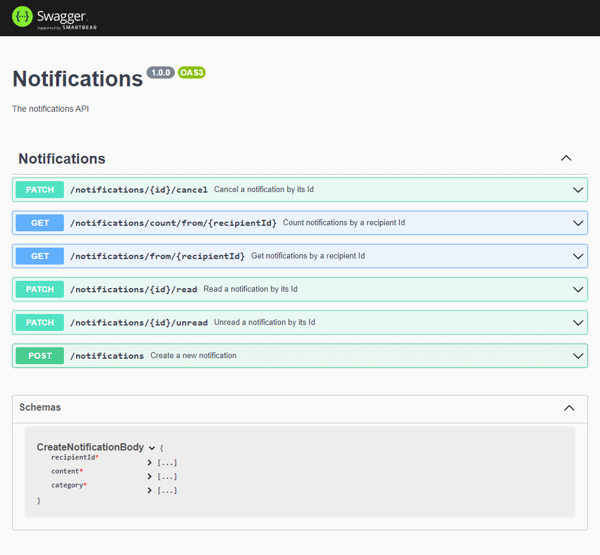

<p align="center">
  <a href="http://nestjs.com/" target="blank"></a>
</p>


## Description

### Microservice for "Notifications" made using the framework TypeScript

[Nest](https://github.com/nestjs/nest) framework TypeScript starter repository.

<br>

## API documentation with Swagger


## Installation

```bash
$ npm install
```

## Running the app

```bash
# development
$ npm run start

# watch mode
$ npm run start:dev
```

## Test

```bash
# unit tests
$ npm run test
```


## License of Nest

Nest is [MIT licensed](LICENSE).
